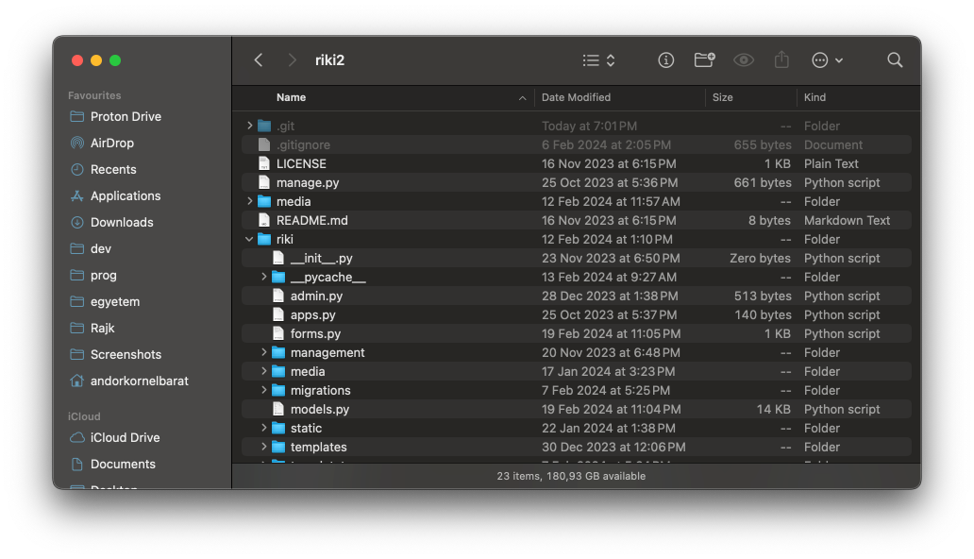
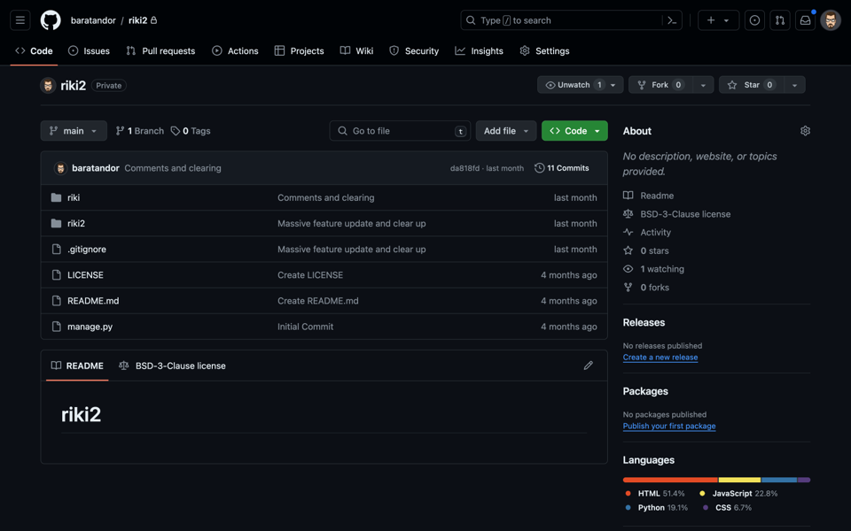
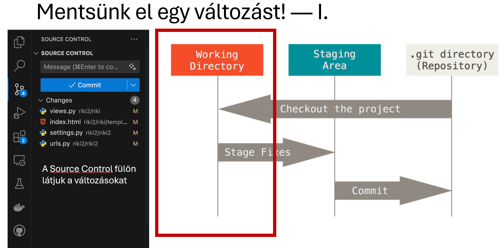
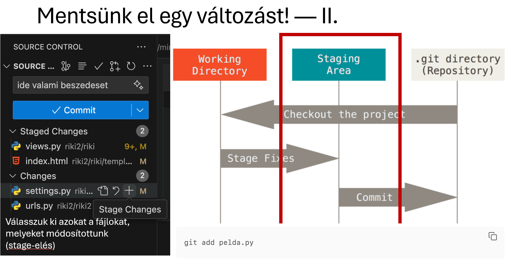
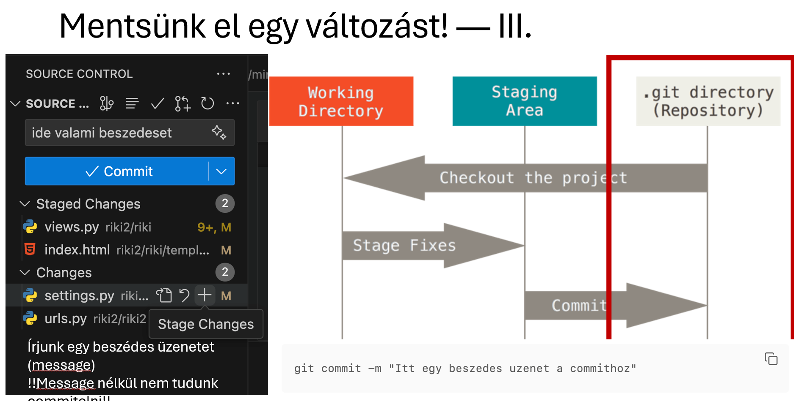
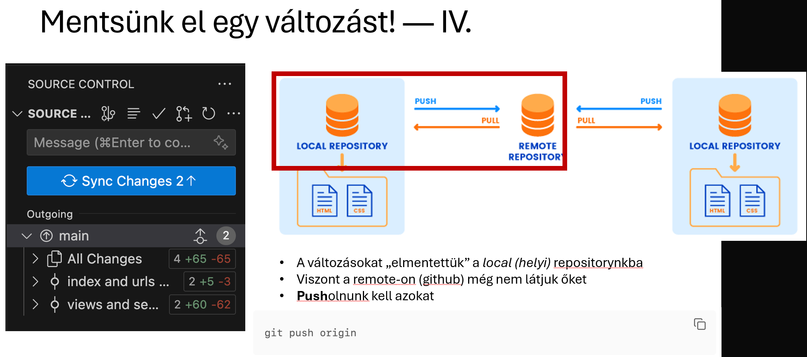
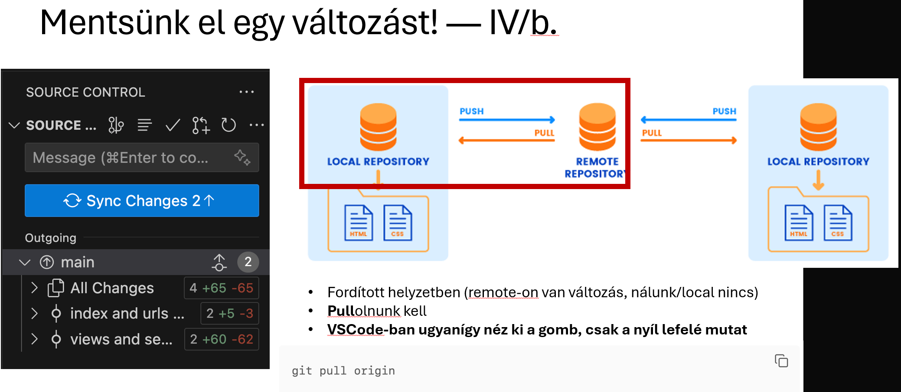

# Algoritmusok bevezető, Git, GitHub

---

## Git, Github


---

### Mi az a Git?

- A Git egy nyílt forráskódú, elosztott verziókezelő rendszer.
- Segít a fejlesztőknek a forráskódban történt változások kezelésében és követésében.
- A Git segítségével különböző verziókat (pillanatfelvételeket) menthetünk a kódról, ami megkönnyíti a projektek kezelését és az együttműködést másokkal.

---

### Mi az a verziókezelő rendszer?

- A verziókezelő rendszer (VCS) egy olyan eszköz, amely nyomon követi egy projekt változásait.
- Segít a fájlok, könyvtárak vagy akár nagy kódbázisok módosításainak kezelésében.
- A VCS lehetővé teszi, hogy több fejlesztő is együtt dolgozhasson egy projekten anélkül, hogy ütközések történnének.
- Két fő típusa van:
  - Központosított (pl. Subversion)
  - Elosztott (pl. Git)

---

### Git vs Más rendszerek

- A Git egy pillanatfelvétel alapú rendszer, amely a fájlszerkezet aktuális állapotát menti el.
- Más rendszerek, mint például a Google Docs, fájl-alapúak, ahol minden fájl módosítása külön kerül rögzítésre.

---

### Miért Git a git?

"git" can mean anything, depending on your mood.

- random three-letter combination that is pronounceable. The fact that it is a mispronunciation of "get" may or may not be relevant.
- stupid. contemptible and despicable. simple. Take your pick from the dictionary of slang.
- "global information tracker": you're in a good mood, and it actually works for you. Angels sing, and a light suddenly fills the room.
- "goddamn idiotic truckload of sh\*t": when it breaks

---

### Hogyan működik a Git?

---

#### Helyi és távoli repository-k

- Helyi repository: A projekt saját példánya a számítógépeden.
- Távoli repository: Egy szerveren tárolt példány, amelyhez más fejlesztők is hozzáférhetnek (pl. GitHub).
- Interakciók: A helyi repository-ban dolgozol, majd megosztod a változásokat másokkal a távoli repository segítségével.

---

#### Helyi repository



---

#### Távolirepository



---

#### Git főbb fázisai

- Munkakönyvtár (Working Directory): Itt történik az aktív munka (fájlok hozzáadása/törlése/szerkesztése).
- Staging terület: Itt választod ki azokat a változásokat, amelyeket commitálni szeretnél.
- Repository: Itt kerülnek tárolásra a commitok (helyileg vagy távolról).

---

#### Git állapotai

- Módosított (Modified): A fájlokban történt változtatásokat még nem állítottad stage-re.
- Stage-elt (Staged): A változások készen állnak a commitálásra.
- Commitált (Committed): A változások elmentésre kerültek a helyi repository-ba.
- Friss (Up-to-date): Nem történt változás az utolsó commit óta.

---

#### Változások mentése VS Code-ban

1. Változások ellenőrzése: A VS Code `Source Control` fülén láthatod a fájlok módosításait.

2. Változások stage-elése: Válaszd ki a fájlokat, amelyeket a következő commitba szeretnél belefoglalni.

3. Commit üzenet írása: Írj leíró üzenetet a változtatásokról (pl. "Bug javítva a bejelentkezési funkcióban").

4. Commitálás: A változások helyi elmentése.

5. Push: A commitált változások feltöltése a távoli repository-ba (pl. GitHub).

---



<!-- fit -->

---



<!-- fit -->

---



<!-- fit -->

---



<!-- fit -->

---



<!-- fit -->

---

#### Változások szinkronizálása

- Push: A helyi változások feltöltése a távoli repository-ba.
- Pull: A távoli repository-ból érkező változások letöltése, ha más fejlesztők is dolgoztak rajta.

---

#### Alapvető Git parancsok

`git clone [URL]`: Egy távoli repository letöltése a saját gépedre.
`git add [filename]`: Fájlok hozzáadása a staging területhez.
`git commit -m "[üzenet]"`: Változások commitálása egy leíró üzenettel.
`git push`: A helyi commitok feltöltése a távoli repository-ba.
`git pull`: Változások letöltése a távoli repository-ból és azok egyesítése a helyi repository-val.

---

### Mi az a GitHub?

- A GitHub egy webalapú platform, amely segít a fejlesztőknek a kód tárolásában, kezelésében és követésében.
- A GitHub felhőben tárolja a Git repository-kat, így könnyebb a csapatmunka.
- A GitHub olyan funkciókat kínál, mint a pull request-ek, kódellenőrzés, és hibakezelés.

---

#### A GitHub főbb funkciói

- Repository tárolás: Git repository-k felhőalapú tárolása.
- Együttműködés: Könnyen megosztható és közösen szerkeszthető kód.
- Pull Requestek: Lehetőség változtatások javaslására, áttekintésére és megbeszélésére.
- Hibakövetés (Issue Tracking): Hibák, funkciókérések és fejlesztések kezelése.
- GitHub Actions: Automatizálás, például tesztelés és kiadás menedzsment.

---

#### Extra Tartalom: Gyakori Git fogalmak

- Branch: Egy fejlesztési vonal egy repository-ban. A branchek között válthatunk vagy egyesíthetjük őket (merge).
- Merge: A változtatások integrálása egy branch-ből egy másikba.
- Fork: Egy repository saját példányának létrehozása, hogy anélkül lehessen változtatni rajta, hogy az eredeti projektet módosítanánk.
- Commit Hash: Minden commit egyedi azonosítója, amely lehetővé teszi a konkrét változtatások visszahívását vagy visszaállítását.

---

### Összegzés

- A Git hatékony eszköz a kódváltoztatások kezelésére.
- A GitHub megkönnyíti az együttműködést a felhőben tárolt repository-k segítségével.

---

## Algoritmusok bevezető

---

### Egyszerűbb példák

- válasszuk ki egy listából az 5 legnagyobb számot
- döntsük el egy számról hogy prím-e
- keressük meg egy szám prím osztóit
- keressünk egy listában két számot amik osztói egymásnak

---

Egy fokkal jobb Fibonacci

```python
def fib_better(n: int) -> int:
    n1, n2 = 1, 1
    if n <= 0:
        return "Please enter a nonnegative integer."
    elif n <= 2:
        return f"{n}. fibonacci: 1"
    else:
        for _ in range(3, n + 1):
            nth = n1 + n2
            n1 = n2
            n2 = nth

        return f"{n}. fibonacci: {nth}"
```

---

### Sárkányos feladat

Egy elszabadult sárkányt keresünk, aki mindig a legnagyobb tehenet eszi meg a királyságban, majd ledől a környéken aludni. Mivel van tehénverseny minden évben, van egy listánk a tehenekről, méret szerint (csökkenő sorrend). Hogy fogunk neki a sárkány megtalálásának, hogy minél kevesebb farmra kelljen menni?

---

#### A bináris keresés bevezetése

- A **bináris keresés** egy hatékony módszer arra, hogy egy **rendezett listában** keressünk elemeket.
- Ahelyett, hogy sorban keresnénk végig minden farmot (vagyis minden tehenet), mindig **kettéosztjuk** a listát.
- Mivel a tehénlista méret szerint rendezett, gyorsabban tudunk keresni, ha minden lépésben **kettéosztjuk** a listát.

---

#### Példa:
[900kg - H, 850kg - É, 800kg - É, 700kg - É, 600kg - É, 500kg - É, 400kg - É]

1. Kezdjük a **középső tehénnel** (700kg).
2. A sárkány tehenének mérete nagyobb vagy kisebb?
   - Ha nagyobb, nézzük a **bal oldalt**.
   - Ha kisebb, nézzük a **jobb oldalt**.
3. Folytassuk az osztást, amíg meg nem találjuk a sárkány által megevett tehenet.

---

#### Miért hatékony a bináris keresés?

- A bináris keresés minden lépésben a keresési területet **felezi meg**.
- Ahelyett, hogy minden farmot végigjárnánk (lineáris keresés), csak **log₂(n)** farmot kell megnéznünk, ahol **n** a tehenek száma.
- 128 tehén esetén a bináris keresés csak 7 lépést igényel ahelyett, hogy mind a 128-at megnéznénk!

---

#### Miért **$log₂(n)$**?

Tegyük fel, hogy van egy $n$ méretű listánk. A kulcskérdés az: Hányszor tudjuk felezni ezt a listát, mielőtt már nincs több elem, amit keresnénk?

1. Az első lépés után a lista mérete $n/2$ lesz.
2. A második lépés után a lista mérete újra feleződik: $n/4$.
3. A harmadik lépés után a lista mérete $n/8$, és így tovább.

Ez a felezés addig folytatódik, amíg csak $1$ elem marad.

---

#### Miért **$log₂(n)$**?

Minden lépésben a lista mérete a felére csökken. Ez azt jelenti, hogy $k$ lépés után a lista mérete: $n/2^k$


A keresés akkor áll le, amikor a maradék lista mérete 1 lesz, azaz: $n/2^k = 1$


Most oldjuk meg $k$-ra (a lépések számára), szorozzuk meg mindkét oldalt $2^k$-val: $n=2k$

Most vegyük a kettes alapú logaritmust mindkét oldalból: $k=log⁡2(n)$

Ez azt jelenti, hogy a lista 1 elemre való csökkentéséhez szükséges $k$ lépések száma $log₂(n)$.

---

#### Összefoglalás:

- A bináris keresés csak **rendezett listákon** működik jól.
- Hatékonyabb, mint minden elem egyenkénti ellenőrzése.
- Ez azt jelenti, hogy a lista 1 elemre való csökkentéséhez szükséges $k$ lépések száma $log₂(n)$.

---

### Tojás

Van két tojásunk és egy 100 emeletes épület. Meg kell
mondanunk, hogy mi az a legmagasabb szint, ahonnan
leejtve még nem törik össze a tojásunk.

```python
def eggs_solution(breaks):
    for i in range(1, 101):
        if breaks(i):
            return i - 1
    return 100

```

---
